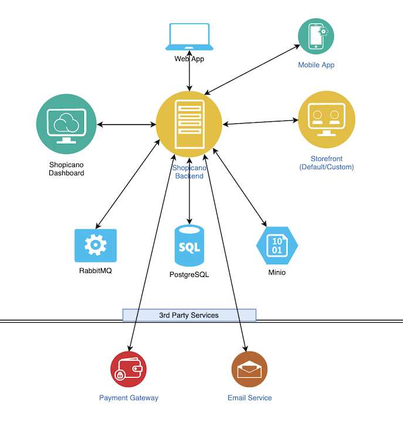

# How it works

Shopicano exposes a RESTful service which can be integrated with anything (ie: Mobile apps, Web apps or any other services).

The below picture is a high level overview of how it works.

The end users are connected to Storefront from where they can browse products, select from them and place orders. Storefront do al these tasks by connecting to backend (Application Server).
Application server maintains connection with other internal and external services (ie: database, blob storage, mail server etc). The store owners being connected to the backend through Dashboard, where they will get UI to manage the store.
Besides there is worker to process long running, time consuming tasks.
