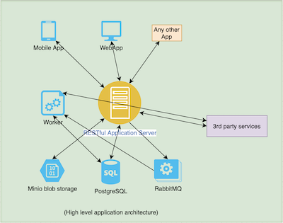

# How it works

Shopicano exposes a RESTful service which can be integrated with anything (ie: Mobile apps, Web apps or any other services).

The below picture is a high level overview of how it works.

The end users are connected to the RESTful web service called application server. Application server maintains connection with other internal and external services (ie: database, blob storage, mail server etc).
There is worker to process long running, time consuming tasks.
